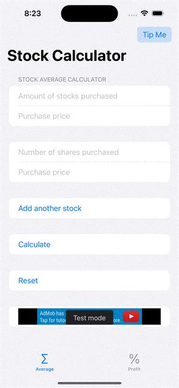
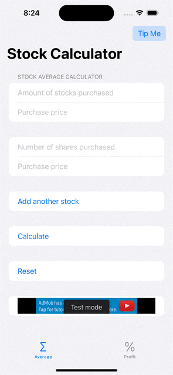

# stock-calculator-SwiftUI
Stock Average Price &amp; Profit Calculator

## Stock Calculator
### A simple stock calculator built using SwiftUI. This calculator provides a native user interface and does not use any custom views, making it lightweight and easy to use.

## Features
### Perform basic stock calculations such as:
#### Calculating the total value of a stock portfolio
#### Calculating the profit/loss of a stock position
#### Intuitive user interface with a clean and native design

## Demo

### Average Price Calculator
 

### Profit Calculator

